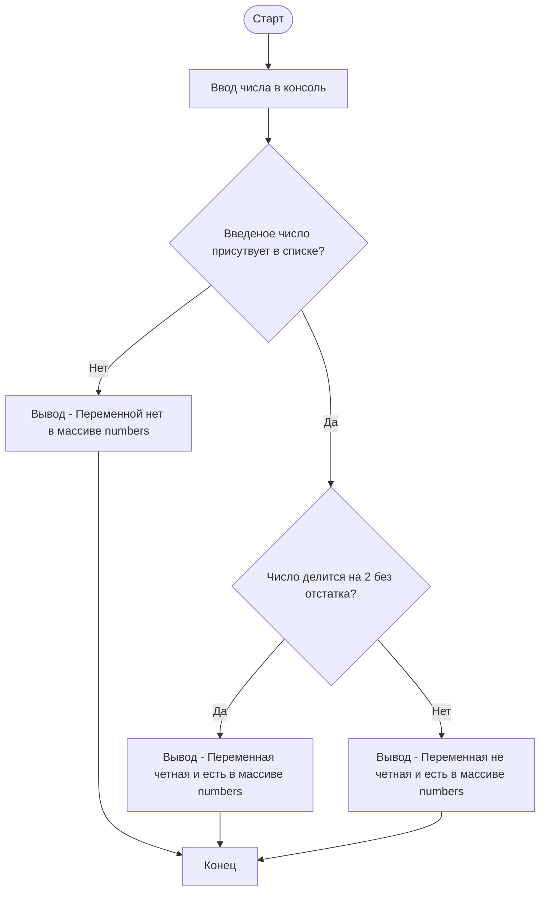

# Тема 3. Операторы, условия, циклы
Отчет по Теме №2 выполнил:
- Нуриев Вадим Гаязович 
- ИНО ЗБ ПОАС-22-2

| Задание | Лаб_раб | Сам_раб |
| ------ | ------ | ------ |
| Задание 1 | + | + |
| Задание 2 | + | + |
| Задание 3 | + | + |
| Задание 4 | + | + |
| Задание 5 | + | + |
| Задание 6 | + | - |
| Задание 7 | + | - |
| Задание 8 | + | - |
| Задание 9 | + | - |
| Задание 10 | + | - |

знак "+" - задание выполнено; знак "-" - задание не выполнено;


## Лабораторная работа №1
### Создайте две переменные, значение которых будете вводить через консоль. Также составьте условие, в котором созданные ранее переменные будут сравниваться, если условие выполняется, то выведете в консоль «Выполняется», если нет, то «Не выполняется».

```python
one = int(input('Введите значение первой переменной: '))
two = int(input('Введите значение второй переменной: '))
if one >= two:
    print('Выполняется')
else:
    print('Не выполняется')
```
### Результат.

[image](https://github.com/VadimNuriev/prog_ing/assets/120504248/09a06bd0-b54f-4f91-84a3-d509c0d6620e)


## Выводы

Блок кода `if one >= two:` выполняется только в том случае, если первая переменная больше или равна второй переменной. В иных случаях будет выполнятся блок кода `else:`.

## Лабораторная работа №2
### Напишите программу, которая будет определять значения переменной меньше 0, больше 0 и меньше 10 или больше 10. Это нужно реализовать при помощи одной переменной, значение которой будет вводится через консоль, а также при помощи конструкций if, elif, else.

```python
one = int(input('Введите значение переменной: '))
if one < 0:
    print('Меньше 0')
elif 0 < one < 10:
    print('Больше 0 и меньше 10')
else:
    print('Больше 10')
```

### Результат

(https://github.com/VadimNuriev/prog_ing/assets/120504248/a066dadb-700d-4fc1-8c46-61b37caba289)


### Выводы

Оператор if-elif-else позволяет проверять несколько условий.
Если `if one < 0:` истинно, тогда выполняется ` print('Меньше 0')`. Если `if one < 0:` ложно, то проверятеся следующее условие `elif 0 < one < 10:`. В случае если оба условия ложны, выполняется блок кода `else:`.

## Лабораторная работа №3
### Напишите программу, в которой будет проверяться есть ли переменная в указанном массиве используя логический оператор in. Самостоятельно посмотрите, как работает программа со значениями которых нет в массиве numbers.

```python
numbers = [1, 3, 5, 6, 8, 11]
value = int(input('Введите значение переменной: '))
if value in numbers:
    print('Переменная есть в данном массиве')
else:
    print('Переменной нет в этом массиве')
```

### Результат


### Выводы

Оператор in используется для определения, присутствует ли конкретный элемент или строка в другой последовательности или строке соответственно. Если искомый элемент или строка найден, оператор вернет логическое значение “истина” (True). В случае, если искомый элемент не будет найден, оператор вернет значение “ложь” (False).
  
## Лабораторная работа №4
### Напишите программу, которая будет определять находится ли переменная в указанном массиве и если да, то проверьте четная она или нет. Самостоятельно протестируйте данную программу с разными значениями переменной value.

```python
numbers = [2,6,8,11,23,31,62,226,444,2024]
value = int(input('Введите значение переменной: '))
if value in numbers:
    if value % 2 == 0:
        print('Переменная четная и есть в массиве numbers')
    else:
        print('Переменная нечетная и есть в массиве numbers')
else:
    print(f"Переменной нет в массиве numbers и она равна {value}")
```

### Результат


### Выводы

Схема выполнения кода:



## Лабораторная работа №5
### Напишите программу, в которой циклом for значения переменной і будут меняться от 0 до 10 и посмотрите, как разные виды сравнений и операций работают в цикле.

```python
for i in range(10):
    print(f"i = {i}")
    if i == 0:
        i += 2
    if i == 1:
        continue
    if i == 2 or i == 3:
        print('Переменная равна 2 или 3')
    elif i in [6, 8, 9]:
        print('Переменная равна 6, 8 или 9')
    else:
        break
```

### Результат


### Выводы

1. Оператор присваивания `+=` прибавляет к переменной. 
2. Оператор присваивания `==` проверяет равна ли переменная
3. Оператор принадлежности `in` проверяет является ли значение частью последовательности.
4. Цикл `for i in range(10):` повторяет цикл 10 раз. С каждым циклом переменная `i` принимает значения на единицу больше чем предыдущее.
5. В случае если значение `i` не удовлетворяет не одно из условий, цикл прерывается оператором `break`.

## Лабораторная работа №6
### Напишите программу, в которой при помощи цикла for определяется есть ли переменная value в строке string и посмотрите, как работает оператор else для циклов. Самостоятельно посмотрите, что выведет программа, если значение переменной value оказалось в строке string.

```python
string = 'Утконос – один из немногих живых видов млекопитающих, откладывающих яйца.'
simb = input('Буква которую вы ищите: ')
for i in string:
    if i == simb:
        index = string.find(simb)
        print(f"Буква '{simb}' есть в строке под {index} индексом")
        break
else:
    print(f"Буквы '{simb}' нет в указанной строке")
```

### Результат


### Выводы

Цикл `for i in string:` проходит по каждому индексу строки. Далее идет проверка условия равен ли символ в данном индексе введенному символу в консоль. В случае если находит, переменной `index` присваивается знаечния индекса символа. Метод `.find()` находит индекс указанного символа.

## Лабораторная работа №7
### Напишите программу, в которой вы наглядно посмотрите, как работает цикл for проходя в обратном порядке, то есть, к примеру не от 0 до 10, а от 10 до 0. В уже готовой программе показано вычитание из 100, а вам во время реализации программы будет необходимо придумать свой вариант применения обратного цикла.

```python
d = 100
for i in range(10,-1,-1):
    d -= i
    print(f"i = {i}, d = {d}")
```

### Результат


### Выводы

`for i in range(10,-1,-1):` использует конструкцию `range(start,stop,step)`. В данном случае начало отсчёта идет от 10 до -1 с шагом -1, таким образом получается обратный отсчёт.

## Лабораторная работа №8
### Напишите программу используя цикл while, внутри которого есть какие-либо проверки, но быть осторожным, поскольку циклы while при неправильно написанных условиях могут становится бесконечными, как указано в примере далее.

```python
num = 0
while num < 10:
    num += 3
    if num % 2 == 0:
        print(f'Число {num} четное')
    else:
        print(f'Число {num} нечетное')
        num -= 1
```

### Результат


### Выводы

Цикл `while num < 10:` работает пока num меньше 10. При каждом проходе цикла num увеличивается на 3. Затем идет проверка делимости на 2. Если num нечетное, то из него вычитается 1.

## Лабораторная работа №9
### Напишите программу с использованием вложенных циклов и одной проверкой внутри них. Самое главное, не забудьте, что нельзя использовать одинаковые имена итерируемых переменных, когда вы используете вложенные циклы.

```python
list = []
n = 0
for i in range(4):
    for j in range(4):
        list.append(f'{i} {j}')
        if i != j:
            n += 1
        else:
            pass

print(f"{list}\nЭлементов в списке {len(list)}. Не совпадающих {n}")
```

### Результат


### Выводы

Данный код создает квадратную матрицу 16x16 благодаря вложенному циклу for. Метод `.append()` добавляет в конец списка значения поодиночке. В переменную `n` записывается число, сколько элементов не имеют совпадающих значений `i` и `j`.

## Лабораторная работа №10
## Напишите программу с использованием flag, которое будет определять есть ли нечетное число в массиве. В данной задаче flag выступает в роли индикатора встречи нечетного числа в исходном массиве, четных чисел.

```python
list = [3, 6, 8, 12, 51, 60]
flag = False
for i in list:
    if i % 2 != 0:
        flag = True
        break

if flag is True:
    print('В массиве есть нечетное число')
else:
    print('В массиве все числа четые')
```

### Результат


### Выводы

В данной программе перебирается список `list`. Как только число из списка делится на 2, `flag` отмечается как True и цикл обрывается оператором break. После работы цикла идет проверка `if flag is True`. Если `flag` не поменял значение с "False", консоль выведет "В массиве все числа четые".

## Самостоятельная работа №1
### Напишите программу, которая преобразует 1 в 31. Для выполнения поставленной задачи необходимо обязательно и только один раз использовать:
#### Цикл for
#### *= 5
#### += 1
### Никаких других действий или циклов использовать нельзя.

```python
x = 1
for i in range(7):
    if x == 6:
        x *= 5
    elif x == 31:
        break
    else:
        x += 1
print(x)
```

### Результат


### Выводы

Цикл for повторяется 7 раз. 
Пока x не равен 6 и 31, он будет увеличиваться на 1. 
Как только x будет равен 6, он умножается на 5 и получается 30. 
После чего x снова увеличивается на 1 и становится равен 31му. 
И на седьмом повторении цикла срабатывает проверка что x равен 31 и цикл прерывается.
  
## Самостоятельная работа №2
### Напишите программу, которая фразу «Hello World» выводит в обратном порядке, и каждая буква находится в одной строке консоли. При этом необходимо обязательно использовать любой цикл, а также программа должна занимать не более 3 строк в редакторе кода.

```python
phrase = 'Hello world'
for i in range(len(phrase)-1,-1,-1):
    print(phrase[i])
```

### Результат


### Выводы

`for i in range(len(phrase)-1,-1,-1):` использует конструкцию `range(start,stop,step)`. В данном случае начало отсчёта идет от рамера длины строки до индекса -1 с шагом -1, таким образом получается обратный отсчёт индексов.
  
## Самостоятельная работа №3
### Напишите программу, на вход которой поступает значение из консоли, оно должно быть числовым и в диапазоне от 0 до 10 включительно (это необходимо учесть в программе). Если вводимое число не подходит по требованиям, то необходимо вывести оповещение об этом в консоль и остановить программу. Код должен вычислять в каком диапазоне находится полученное число. Нужно учитывать три диапазона:
#### от 0 до 3 включительно
#### от 3 до 6
#### от 6 до 10 включительно
### Результатом работы программы будет выведенный в консоль диапазон. Программа должна занимать не более 10 строчек в редакторе кода.

```python
num = int(input('Введите число от 0 до 10: '))
if 0 <= num <= 3:
    print('Число в дипазоне между 0 и 3 включительно.')
elif 3 < num < 6:
    print('Число в дипазоне между 3 и 6.')
elif 6 <= num <= 10:
    print('Число в дипазоне между 6 и 10 включительно.')
else:
    print('Ошибка. Число не принадлежит диапазону от 0 до 10.')
```

  ### Результат


### Выводы

Для проверки нескольких условий используется конструкция if-elif-else.
  
## Самостоятельная работа №4
### Манипулирование строками. Напишите программу на Python, которая принимает предложение (на английском) в качестве входных данных от пользователя. Выполните следующие операции и отобразите результаты:
#### - 1. Выведите длину предложения.
#### - 2. Переведите предложение в нижний регистр.
#### - 3. Подсчитайте количество гласных (а, е, і, о, u) в предложении.
#### - 4. Замените все слова "ugly" на "beauty".
#### - 5. Проверьте, начинается ли предложение с "The" и заканчивается ли на "end".
### Проверьте работу программы минимум на 3 предложениях, чтобы охватить проверку всех поставленных условий.
  
```python
text = input('Enter the text in English: ')
vow = 0
checkThe = 'Предложение не начинается на "The"'
checkEnd = 'не заканчивается на "end"'
length = len(text)
text = text.lower()
for i in range(length):
    if text[i] == 'a' or text[i] == 'e' or text[i] == 'i' or text[i] == 'o' or text[i] == 'u':
        vow += 1
text.replace(' ugly', ' beauty')

if text[:3] == 'the':
    checkThe = 'Предложение начинается на "The"'
if text[-4:] == ' end' or text[-5:] == ' end.':
    checkEnd = 'заканчивается на "end"'

print(f'{text}\nДлина предложения - {length}\nГласных "a, e, i, o, u" в тексте - {vow}\n{checkThe} и {checkEnd}.')
```

### Результат


### Выводы

1. Метод `len()` находит длину строки.

2. Метод `lower()` переводит строку в нишний регистр.

3. Цикл `for i in range(length):` проходит по каждому индексу (символу) строки. Данный цикл имеет блок кода, который проверяет что символ равен указанномй гласной. Если символы совпадают, то перменная `vow` увеличивается на 1 (данная переменная хранит значение количества совпадающих гласных).

4. Метод `replace('ugly', 'beauty')` заменяет в тексте все слова "ugly" на "beauty".

5. `if text[:3] == 'the':` проверяет что первые 3 символа строки равны "the". `if text[-4:] == ' end' or text[-5:] == ' end.':` проверяет что последние 4 символа это отдлельное слово "end" или, если строка оканчивается на ".", проверяеются последние 5 символов, включая пробел, "end" и точку.
  
## Самостоятельная работа №5
### Составьте программу, результатом которой будет данный вывод в консоль:
#### 

### Программу нужно составить из данных фрагментов кода:
#### 

### Строки кода можно использовать только один раз. Не обязательно использовать все строки кода.

  
```python
string = 'hello'
memory = ' world'
values = [0, 2, 4, 6, 8, 10]
counter = 0
while counter != 10:
    if counter in values:
        print(string + memory)
        print(string)
    counter += 1
string = string + ' world'
memory = string
print(memory)
```

### Результат


### Выводы

Пока цикл не равен 10 он будет повторятся. При каждом повторении переменная `counter` увеличивается на единицу. Каждый раз когда `counter` будет равен числу содержащемуся в списке `values` он будет печатать 'hello world" и "hello". Блок проверки сработает всего 5 раз, т.к. цикл работает до 10. 
После цикла необходимо написать ещё одну строку "hello world". Для этого переменная `string` дополняется строкой " world" и присваивается переменной memory. Полсе чего печататеся переменная `memory` содержащая строку "hello world".

## Общие выводы по теме

1. Python имеет богатый набор операторов, включая арифметические, логические, битовые, а также операторы сравнения и присваивания;

2. Условные операторы, такие как if-elif-else, позволяют выполнять различные блоки кода в зависимости от заданных условий;

3. Циклы, такие как for, while и range(), позволяют выполнять блоки кода многократно, пока не будет выполнено определенное условие;

4. Вложенные циклы позволяют последовательно перебирать элементы из нескольких последовательностей или итерируемых объектов;
